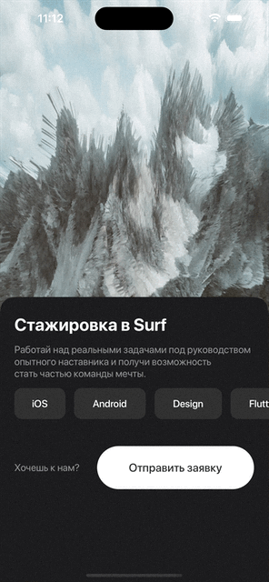

<h1 align="center">SerfInternship</h1> 
<h1 align="center">Test app for <a href="https://surf.ru">Serf</a> from the public <a href="https://github.com/surfstudio/Surf-iOS-Developers/blob/master/Docs/Hiring/students-test-project.md">gitHub</a> repository.</h1> 

## Technical Stack

* iOS 16+
* Swift 5
* SwiftLint
* SwiftGen
* <a href="https://www.figma.com/file/S4ucVLUHYc0vLg2p1Xnart/IOS-стажировка?node-id=45%3A77&t=VmBumf97MCpUCuot-0">Design</a>

## Overview

<table>
    <thead>
        <tr>
            <th>8 iphone light</th>
            <th>8 iphone dark</th>
        </tr>
    </thead>
    <tbody>
        <tr>
            <td>
                
            </td>
            <td>
                
            </td>
        </tr>
    </tbody>
</table>

<table>
    <thead>
        <tr>
            <th>13mini light</th>
            <th>13mini dark</th>
        </tr>
    </thead>
    <tbody>
        <tr>
            <td>
                
            </td>
            <td>
                
            </td>
        </tr>
    </tbody>
</table>

<table>
    <thead>
        <tr>
            <th>14pro max light</th>
            <th>14pro max dark</th>
        </tr>
    </thead>
    <tbody>
        <tr>
            <td>
                
            </td>
            <td>
                
            </td>
        </tr>
    </tbody>
</table>

<table>
    <thead>
        <tr>
            <th>Ipad pro 12.9 light</th>
            <th>Ipad pro 12.9 dark</th>
        </tr>
    </thead>
    <tbody>
        <tr>
            <td>
                
            </td>
            <td>
                
            </td>
        </tr>
    </tbody>
</table>

<table>
    <thead>
        </tr>
    </tbody>
</table>

